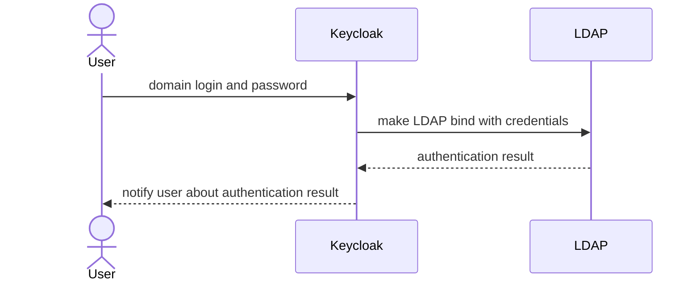

Here is full authentication articles list:

- [Enterprise Authentication. Part 1. Basics](/posts/authn)
- Enterprise Authentication. Part 2. Directory Services and LDAP <- you are here
- [Enterprise Authentication. Part 3. Kerberos](/posts/authn-krb)
- Enterprise Authentication. Part 4. SAML
- Enterprise Authentication. Part 5. OIDC
- Enterprise Authentication. Part 6. Keycloak in depth


> Disclaimer: Here, we will briefly cover the capabilities of X500 directories and the LDAP protocol. We will stop at the point where we can confidently extract the necessary user authentication information for Keycloak using LDAP. If you want to deepen your knowledge, you can refer to the official [ISO standards for X50x](https://www.iso.org/standard/80313.html) (they charge 150 francs for the document; if you speak Russian, you can read the corresponding [ГОСТ for free](https://meganorm.ru/Index/18/18632.htm)), as well as resources like [ldap.com](https://ldap.com/) (if you speak Russian, I also recommend [pro-ldap.ru](https://pro-ldap.ru/)).

## Directory Services
Every organization strives to centrally manage the rights and permissions of its employees across the entire landscape. To automate this process, many different IDM systems have been adopted by organisations, but one way or another, they all rely on a **Directory Service** (or simply **DS**), which acts like a database storing users, their rights, permissions, and much more. This is what we will discuss here.

Typically, a DS has a hierarchical, tree-like structure similar to a file system, where the root is the domain (DC), followed by container elements like O (organization) or OU (organizational unit), and terminal elements like persons, groups, etc with CN (common name). 

The DS is also associated with the concept of a DNS domain (DC), such as `mydomain.com`, as the domain is the root of the directory service hierarchy. Subdomains, like `a.mydomain.com` and `b.mydomain.com`, can also exist. Altogether, this structure is called a **Tree**. Furthemore, some DS implementations (e.g., Microsoft Active Directory and FreeIPA) allow creating multiple domain trees, resulting in a sprawling structure referred to as a **domain forest**.

Currently, there are many implementations of directory services, with Microsoft Active Directory being the most widespread. However, OpenSource DS implementations like Samba DC, FreeIPA, and OpenLDAP are gaining popularity, along with less common vendors like Novell eDirectory and Communigate LDAP. For our exercises, we will use a pre-configured OpenLDAP container, which you can find [here](https://github.com/ondator/sandboxes).

Inside the directory, you can store almost anything: users, printers, workstations, technical accounts (gMSA), and much more. But since we're focusing on authentication, we'll limit ourselves to users, groups, and container objects. First, it's important to note that every object in a directory service has a unique path (**Distinguished Name** or **DN**), which also serves as an identifier to locate the object. For example: `CN=Bob,OU=MF,OU=IT Department,DC=example,DC=org`. Second, each object has a class. Typically, the users we're interested in belong to the `inetOrgPerson`, `person` and/or `organizationalPerson` classes.
Additionally, each user can have a large set of attributes, both standard and custom. 

> all standart attributes can be found in [RFC2256](https://www.ietf.org/rfc/rfc2256.txt)

Here are some useful standard attributes:

| Description | attribute name(OpenLDAP*) | attribute name(AD) | example |
| --- | --- | ---- | ---- |
| Path to user in DS | entryDN | distinguishedName | CN=Bob,OU=MF,OU=IT Department,DC=example,DC=org |
| username with domain | krbPrincipalName** | userPrincipalName | bob@mydomain.com |
| username without domain | cn | sAMAccountName | bob |
| user's groups | memberOf*** | memberOf | CN=My Awesome Group,OU=Groups,DC=example,DC=org |
| user's first name | givenName | givenName | Bob |
| user's second name | sn | sn | Smith |
| user's full name | displayName | displayName | Bob Jason Smith |
| user's job title | title | title | Project Manager |
| user's email | Email | mail | bob.smith@example.org |

\* Also valid for FreeIPA.

** actualy krbPrincipalName and UserPrincipalName could have some difference in domain and krbPrincipalName is not a standart attribute, so you should set up Kerberos extension to obtain it

*** memberOf extension should be installed. Furthemore it works only with groupOfNames groups

> Additionally, in MS AD, users have `extensionAttribute0-15`, and AD administrators often store important data in it

> Classes, attributes, etc., in DS are typically controlled by a schema, which can be extended by administrators with sufficient expertise (though this, along with DIT modeling and other administrative nuances, is beyond the scope of this document).

## LDAP
To access this wealth of information, the LDAP protocol is used. LDAP is a specialized protocol designed to provide a standard interface for all directory services. Like any respectable protocol, it can operate over SSL (LDAPS). LDAP includes several operations for full directory interaction, but since we're focusing on authentication, we won't cover all of them. We'll focus on two: `search` and `bind`.

### Bind
`Bind` is the simplest authentication operation built into the LDAP protocol. There are two options: SASL and simple (username-password). Keycloak doesn't support SASL, so we'll focus on `simple bind`. Simple bind is quite simple: you provide your DN and password and if authentication succeeds, a success result with code `0` is returned. If it fails, an error is returned, with the most interesting being `49` (`InvalidCredentials`). In AD, additional explanatory codes are provided in the `data` field, such as `52e` (user DN exists, but the password is incorrect). 

LDAP `simple bind` is highly insecure, especially without SSL (LDAP without S), as it transmits credentials in plain text, making them easy to intercept. 

> If you want to dive deeper in LDAP bind security, here's [an article](https://habr.com/ru/companies/avanpost/articles/484186/) on why you should never use LDAP bind, even for intranet authentication.

However, for external systems using DS as a user and permissions database, LDAP bind is a necessary evil. For other scenarios, we'll discuss Kerberos later.

> Here's a great [image for Active Directory penetration testing](https://orange-cyberdefense.github.io/ocd-mindmaps/img/pentest_ad_dark_2022_11.svg) (zoom out to see the full picture). Note that hackers first attempt to enumerate users via `ldapsearch -x`, so exposing LDAP to the internet is a bad idea—it's best to restrict it to internal networks or use SASL (though I've rarely seen this implemented).

### Search
`Search` is the operation for querying the DS. To perform a search, you need to provide:
- A search filter in a specific format.
- A base DN to start the search from.
- A scope, which specifies whether to search only at the current level (`base`), only the children of the specified DN (`one`), or recursively traverse the entire subtree (`sub`).
- A set of attributes to include in the results.

You can experiment with `search` using the `ldapsearch` utility. For example:
```bash
ldapsearch -D "cn=my-account,dc=example,dc=org" -b "dc=example,dc=org" -s sub "(&(objectclass=inetOrgPerson)(objectclass=organizationalPerson))" uid, mail, sn, givenName
```

This command authenticates to the directory under the account with DN cn=my-account,dc=example,dc=org and searches recursively from dc=example,dc=org for all entries where the class is both inetOrgPerson and organizationalPerson, returning the uid, mail, sn, and givenName attributes.

> LDAP search supports pagination, where the DS returns results along with tokens for pagination. Unfortunately, not all DS implementations support this.

## Keycloak Configuration

First, let's define our goal: we want users from the DS to authenticate in Keycloak using their domain credentials (username and password). The flow looks like this:



> I recommend practicing with a test sandbox, which you can download [here]((https://github.com/ondator/sandboxes)). You'll need the `keycloak/keycloak-postgres-dc.yml` compose file.

To set up LDAP integration in Keycloak, create a new User Federation entity. On the corresponding tab, create a new provider of type LDAP. A window with many input fields will appear, which we need to fill out:

+ UI display name: A name for display; doesn't affect functionality.

+ Vendor: A crucial selector that makes Keycloak made vendor-specific tweaks. For example, for MS AD will be preconfigured some mappers such as MSAD Account Controller. If your DS vendor is listed, select it. For FreeIPA, Samba, or OpenLDAP (our case), choose "Other".

+ Connection URL: The path to the LDAP server, including the protocol (e.g., ldap://ldap).

+ Enable StartTLS: Forces the LDAP server to switch from unsecured ldap to secured ldaps. Only works if the server supports it, and you must add the certificate to Keycloak's truststore beforehand (more on this later). Leave this unchecked for our experiments.

+ Use Truststore SPI: Determines where trusted SSL certificates are sourced. If set to "Always," you can specify the certificate path via environment variables. If "Never," only the default Java keystore is used. Since we're using an unencrypted connection, this doesn't matter for us.

+ Connection pooling: Creates and uses a pool of LDAP connections. Unnecessary if you don't plan always read user info directly from LDAP

+ Connection timeout: Timeout for connecting to the LDAP server. Note: This is the timeout for the **connection**, not for reading data (it will be later)

+ Bind type: Two options: simple (simple bind) or none (anonymous access). SASL isn't supported. We'll choose simple.

+ Bind DN and Bind credentials: Credentials for connecting. Note: Bind DN must be the full DN, not just the username/cn/sAMAccountName. In our case, it's cn=keycloak2,ou=tuz,dc=example,dc=org / password.

> At this point, I strongly recommend clicking the Test connection and Test authentication buttons. If everything is correct, you should see two green popups. 

Next LDAP Searching and Updating section:

+ Edit mode: Three options:

  - READONLY: The most common option. Users are imported from LDAP and saved without reverse synchronization, but they remain read-only in Keycloak.

  - WRITABLE: Users are synchronized bidirectionally. Useful if Keycloak is used not just for IAM (access management) but also for IDM (user, rights, and permissions management). Use at your own risk.

  - UNSYNCED: Similar to READONLY, but users can be modified in Keycloak. Useful for hacks, like changing attributes imported from LDAP.

+ Users DN: The base container from which users will be imported. You can simply set the root domain container, but usually, a higher-level container with users is preferred. We will use ou=people,dc=example,dc=org.

+ Username LDAP attribute: The attribute used as the username in Keycloak. For MS AD, this is usually UserPrincipalName; for others, cn. Sometimes, for AD, sAMAccountName is used. The value of this field is mapped to the username in the mapper (more on mappers later).

+ RDN LDAP attribute: A unique attribute to distinguish users. Typically cn or uid (always cn in AD). For us, any will work; I chose uid.

+ UUID LDAP attribute: The internal ID attribute of the directory entry. In MS AD, this is objectGUID; in others, usually entryUUID.

+ User object classes: The classes to import from the LDAP directory. Usually inetOrgPerson and organizationalPerson, but confirm with the directory admin.

+ User LDAP filter: If you don't need all users (for example only users in a specific group), specify an LDAP filter here. Leave empty for our case (or you can experement with it).

+ Search scope: The search scope, as discussed earlier. Options: OneLevel (only the current level) or Subtree (recursively traverse the entire subtree). Almost always use Subtree.

+ Read timeout: Timeout for reading data. If the LDAP server doesn't respond within this time, synchronization will fail. We won't set this.

+ Pagination: Enables pagination. Unfortunately, not all servers support it, and some explodes when it's enabled. We'll disable it.

+ Import users: A critical checkbox. If disabled, users won't be imported into Keycloak; instead, they'll be imported on-demand when a user attempts to authenticate. If you need users in Keycloak (e.g., for API operations), leave this enabled. We'll leave it enabled.

+ Sync Registrations: Keycloak supports self-registration. If enabled, registered users will also be added to LDAP. I always disable this and recommend you do the same.

+ Batch size: The batch size if pagination is enabled.

+ Periodic full sync and Full sync period: Enables and sets the interval for full user synchronization. If enabled, users will be fully reloaded from the LDAP directory periodically. I enable this with a daily interval.

+ Periodic changed users sync and Changed users sync period: Same as above, but for delta synchronization. I usually set this to every 4 hours.

Kerberos settings will be covered in the next part. Cache settings rarely need adjustment from defaults. Let's look at Advanced settings:

+ Enable the LDAPv3 password modify extended operation: Allows external password resets using the ["LDAP Password Modify Extended Operation"](https://www.rfc-editor.org/rfc/rfc3062.html). To use this, you must enable Sync Registrations.

+ Validate password policy: Keycloak supports password policies (e.g., requiring 5 digits, uppercase letters, special characters, etc.). If enabled, Keycloak will enforce these policies, even for passwords stored in the DS. Usually, passwords are managed in the DS, so disable this.

+ Trust Email: Marks users' emails as "verified" in Keycloak. Enable this to avoid alerts about unverified emails.

After filling all fields, click Save.

Once configured, you can try importing users into Keycloak (if Import users is enabled). At the top of the screen, next to the Disabled checkbox, there's an Action menu with several options:


+ Sync changed users: Synchronizes changed data from the directory.

+ Sync all users: Synchronizes all users from the directory.

+ Unlink users: Removes the federation link from users, making them local. All attributes are preserved. Note: This is irreversible without manual database intervention.

+ Remove imported: Deletes users imported via this federation from Keycloak.

+ Delete provider?: Deletes the federation.

If you run Sync all users, new users should appear in the Users section after some time. Note that these users have a Federation link.


> Important: Users imported from a federation are fundamentally different from local users created manually in Keycloak. Most attributes are controlled by the federation, some may be read-only, and others may appear on-demand (more on this in the mappers section). Also, a federated user can only be linked to one federation—not multiple LDAP directories.

Now, try logging out of Keycloak and logging back in with a domain account (e.g., alice:password). If you see "No realm access," it's a success (Alice lacks admin permissions).

### Certificates
If your Keycloak version is below 18 and you can't update, you must manually add the certificate to the Java keystore:

```sh
keytool -importcert -alias ldapcert -cacerts -noprompt -trustcacerts -file /opt/jboss/keycloak/standalone/configuration/ldap.cer
```

For newer Keycloak versions, use the Truststore SPI. Specify the certificate path in the environment variables:

```sh
KEYCLOAK_HTTPS_KEY_STORE_FILE: /path/to/truststore.jks
KEYCLOAK_HTTPS_KEY_STORE_PASSWORD: .....
```

> For quay.io images, use KC_HTTPS_KEY_STORE_FILE and KC_HTTPS_KEY_STORE_PASSWORD.

Don't forget to set Use Truststore SPI to "Always."

### Mappers
Every user imported from an LDAP directory into Keycloak has attributes like Firstname, Lastname, and Email. How does Keycloak know which data to map to which attributes? And what if you need to extend a user with a new attribute? Here comes mappers.

Go to your federation and switch to the Mappers tab. Here, you'll see a list of mappers Keycloak created by default. Let's create a new mapper. Click Add mapper and fill in the name and mapper type. The mapper type is crucial, here are the most useful ones:

+ user-attribute-ldap-mapper: Maps an attribute from LDAP to a user attribute. The most common type.

+ hardcoded-attribute-mapper: Assigns a fixed value (always the same) to an attribute for every user.

+ hardcoded-ldap-role-mapper: Assigns every user to a specific role.

> MS AD has a specific msad-user-account-control-mapper that controls user "enabled" status by catching special error codes like 553 and 775. Other DS implementations don't manage user activity this way.

Let's focus on user-attribute-ldap-mapper, as it's the most frequently used:

+ User Model Attribute: The Keycloak user attribute where the LDAP value will be stored. Note: Users have standard attributes (username, firstName, etc.), but custom ones can be added.

+ LDAP Attribute: The LDAP attribute to map to the Keycloak user attribute.

+ Read Only: If the federation's Edit mode is WRITABLE, this flag prevents synchronizing the attribute back to LDAP.

+ Always Read Value From LDAP: Flag markes attributes which should always bin read directly from LDAP. This means every access to this user triggers an LDAP query, and the attribute may not be stored locally. Some default Keycloak mappers have this flag.

+ Is Mandatory In LDAP: This flag has misleading name. This doesn't enforce the attribute's presence in LDAP but sets a default value if missing.

+ Attribute default value and Force a Default Value: Define the default value. If **both** are set, the specified default is used; otherwise, a space (" ") is used.

+ Is Binary Attribute: For binary data (e.g., images or certificates) in attributes. If enabled, the attribute will always be read from LDAP and never stored locally.

After saving the mapper and re-syncing users, the new attribute will appear in user profiles.

### Debugging

Here is some tricks for debugging LDAP integration:

+ LDAP typically uses port 389 (or 636 for LDAPS). First, check if the ports are open with `curl -k ldap://ldap`.

+ Enable detailed LDAP logging in Keycloak. For bitnami containers, set:

```
KEYCLOAK_LOG_LEVEL: WARN,...,,org.keycloak.storage.ldap:trace
```

> For quay.io containers, use KC_LOG_LEVEL. For JAR deployments, configure in standalone-ha.xml.

+ If you see SSLHandshakeException, add the certificate to the truststore as described earlier.

+ If LDAP bind fails with MS AD, the error code in the data field can help diagnose the issue:

  - 52e: Correct username, wrong password.

  - 533: User is disabled.

  - 775: User is locked.

  - 532 and 773: Password expired.


We'll finish here with LDAP and DS, on the next part we will improve our DS integration with Kerberos protocol.