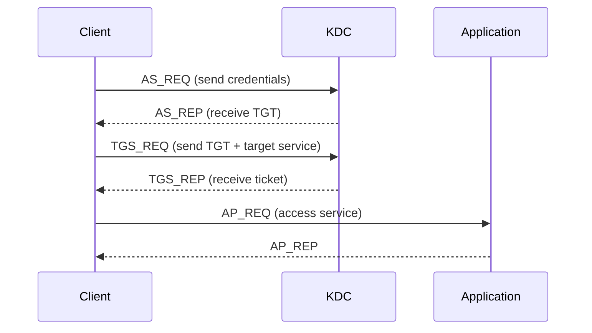

Here is full authentication articles list:

- [Enterprise Authentication. Part 1. Basics](/posts/authn)
- [Enterprise Authentication. Part 2. Directory Services and LDAP](/posts/authn-ldap)
- Enterprise Authentication. Part 3. Kerberos <- you are here
- [Enterprise Authentication. Part 4. SAML](/posts/authn-saml)
- Enterprise Authentication. Part 5. OIDC
- Enterprise Authentication. Part 6. Keycloak in depth


In the previous part where we discussed LDAP, we partially covered security aspects of that protocol and concluded that using pure LDAP bind won't get us very far. But what if we still want centralized user and permission management while also having reliable and secure authentication? This is where Kerberos comes to the rescue.

> **Disclaimer**: I'll describe everything as simply as possible here, omitting details and apologizing in advance for any implementation inaccuracies (for example, I intentionally skipped all cryptography). The goal is to understand Kerberos well enough to configure client applications. We won't cover KDC setup or protocol nuances here. For deeper understanding, read Kerberos RFC [4120](https://datatracker.ietf.org/doc/html/rfc4120) and browse the [consortium website](https://kerberos.org/).

## WTF is Kerberos  

The core assumption of Kerberos is operation in an untrusted network - no confidential data is transmitted openly. To be able to operate in such an environment, we need a trusted authentication information keeper. We'll send our credentials (username/password) to this keeper and receive keys to prove our identity to other systems. Since this keeper distributes keys, we call it the Key Distribution Center (KDC).

What's inside a key? It contains:
1. Key owner (Client Principal)  
2. Target application (Service Principal)  
3. Issue timestamp and expiration  
4. Secret session key known only to the application and (now) client  

This key (or ticket in Kerberos terms) can be presented to applications to verify our identity. In reality, the process involves two KDC interactions:




Why two KDC trips? Couldn't we request a service ticket directly? Technically yes (using `kinit -s`), but this would break SSO functionality (as we will discuss later). Normally, we first get a Ticket-Granting Ticket (TGT), then exchange it for final service tickets.

An observant reader might note that sending plaintext credentials in AS_REQ would make Kerberos no better than Basic Auth. Actually, Kerberos works differently - AS_REQ only contains the Principal name, while the TGT in AS_REP is encrypted with the user's password-derived key.

Next I'll bring it here a little Kerberos terminology dictionary:

+ Realm: A Kerberos tenant (usually matches corporate domain in UPPERCASE, e.g., EXAMPLE.ORG)
+ Principal: An authenticatable entity (users or services). It could be Service Principal to autenticate application or User Principal to autenticate person, but both have kerberos principal as some an attribute (for MIT Kerberos it is krbPrincipalName) which could be considered some kind of kerberos username
+ SPN: Service Principal Name. It's kerberos principal of service. Has format of protocol/service_URL@REALM, e.g., HTTP/keycloak@EXAMPLE.ORG (because it's webservice on the keycloak domain and presented in EXAMPLE.ORG realm). If we want to autenticate smtp service than we had something like SMTP/postfix.example.org@EXAMPLE.ORG
+ UPN: UserPrincipalName (LDAP attribute in ActiveDirectory). In ActiveDirectory usualy equals kerberos principal, but may differ
+ Keytab: As we discussed earlier, principals can be either User or Service principals. During authentication (AS_REQ/AS_REP), a human User Principal can provide credentials (e.g., password), but what about a machine Service Principal? This is where keytabs (short for key table) come in.
A .keytab file essentially stores the Service Principal's "password" (actually, a securely encrypted key) used to authenticate with the KDC.
+ KVNO: The KVNO (Key Version Number) tracks the version of a principal's secret key. When a principal's password is changed, a new secret key is generated. To invalidate old tickets signed with the previous key, the KVNO is incremented. Essentially, it's a version counter that increases with each password change.
+ KDC: Key Distribution Center (Kerberos server)
+ AS: Authentication Server (handles AS_REQ/AS_REP)
+ TGS: Ticket Granting Server (handles TGS_REQ/TGS_REP)
+ TGT: Ticket-Granting Ticket (exchangeable for service authentication tickets)
+ krbtgt: Special Kerberos service that issues TGTs (all TGT encrypted using krbtgt/EXAMPLE.ORG@EXAMPLE.ORG principal key)

## The Magic of SSO

Kerberos' real power isn't just secure authentication, but enabling Single Sign-On (SSO) - accessing systems without repeated credential entry. This works because tickets can be securely presented to the KDC. Applications simply request the user's ticket via SPNEGO over GSS-API.

## GSS-API

> Defined in [RFC 2743](https://datatracker.ietf.org/doc/html/rfc2743) and [RFC 4121](https://datatracker.ietf.org/doc/html/rfc4121) 

GSS-API simply provides a unified interface for security protocols (Kerberos, SASL, NTLM, etc.) - similar to how SCSI abstracts disk interfaces in Unix.

## SPNEGO

> Defined in [RFC 4178](https://datatracker.ietf.org/doc/html/rfc4178), with token flow in [RFC 4559](https://datatracker.ietf.org/doc/html/rfc4559)

So, we have a collection of security services wrapped into the unified GSS-API interface. The only missing piece is a way to select the most suitable authentication mechanism from this variety. This is where SPNEGO (Simple and Protected GSS-API Negotiation Mechanism) comes into play.

SPNEGO organizes these GSS-API mechanisms into a priority queue, with the most preferred method at the top, followed by the rest in descending order of preference. For example, if our system supports Kerberos, NTLM, and basic username/password authentication, SPNEGO will present these options to Keycloak. Keycloak then selects the highest-supported method that best fits our needs.
How It Works:
1. Negotiation Trigger: Keycloak sends a 401 Unauthorized response with the header `WWW-Authenticate: Negotiate`
This signals the browser to initiate authentication via SPNEGO.

2. Ticket Acquisition & Submission: The browser uses GSS-API to obtain a Kerberos ticket for a principal in the format: HTTP/<service_url>@REALM  
It wraps the ticket into a GSS-API InitialContextToken and sends it back in the request header: `Authorization: Negotiate <token_here>`

3. Fallback Mechanism: If Keycloak cannot process the Kerberos ticket, SPNEGO retries with the next-best supported mechanism (e.g., NTLM or basic auth).

This cycle repeats until the browser and Keycloak agree on a mutually supported method.


## KDC Setup

> For practice, you can use my [docker-compose sandbox](https://github.com/ondator/sandboxes) (keycloak/keycloak-postgres-dc.yml)

> Normally done by domain admins in production

In our test container (kdc):

1. Create Keycloak principal:
  ```sh
    $ kadmin.local
    $ addprinc -x dn=cn=keycloak2,ou=tuz,dc=example,dc=org HTTP/keycloak2
  ```
2. Make Alice a Kerberos principal:
  ```sh
     $ kadmin.local
     $ addprinc -x dn=cn=Alice,ou=people,dc=example,dc=org alice
  ```
3. Generate keytab in keycloak2 container:
  ```sh
     $ kadmin -p HTTP/keycloak2@EXAMPLE.ORG
     $ ktadd -k /tmp/kc2.keytab HTTP/keycloak2
  ```

Finaly in keycloak2 container should appears /tmp/kc2.keytab file and `KRB5_TRACE=/dev/stdout kinit -k -t /tmp/kc2.keytab HTTP/keycloak2@EXAMPLE.ORG` you should not have errors and in response to `klist -l` obtain something like 
```sh
Principal name                 Cache name
--------------                 ----------
HTTP/keycloak2@EXAMPLE.ORG          FILE:/tmp/krb5cc_1001
```

## Keycloak Configuration

1. Open port 88 between Keycloak and KDC

2. Get SPN and keytab (see above)

3. Create /etc/krb5.conf:
```ini
[libdefaults]
 default_realm = EXAMPLE.ORG

[realms]
 EXAMPLE.COM = {
  kdc = DC.EXAMPLE.ORG
  default_domain = EXAMPLE.ORG
 }
```
Find KDC IP via: `nslookup -type=any _kerberos._tcp.EXAMPLE.ORG`

4. Test authentication: `KRB5_TRACE=/dev/stdout kinit -k -t /tmp/kc2.keytab HTTP/keycloak2@EXAMPLE.ORG`
5. In Keycloak:
   + For LDAP+Kerberos: Enable "Allow Kerberos authentication" in User Federation
   + For pure Kerberos: Create new Kerberos-type federation
6. Configure fields:
   + Kerberos realm: EXAMPLE.ORG
   + Server principal: HTTP/keycloak2@EXAMPLE.ORG
   + Key tab: Path to keytab (e.g., /tmp/kc2.keytab)
   + Kerberos principal attribute: Maps LDAP users to Kerberos principals
      + For OpenLDAP/MIT Kerberos: Use krbprincipalname
      + For ActiveDirectory: Try UserPrincipalName or leave blank
   + Enable Debug for verbose logging
   + Optionally enable Use Kerberos for password authentication
7. For Kerberos-only federation, "Update first login" can sync ticket data (usually not useful)

8. Enable SPNEGO:

  + Go to Authentication → Browser flow

  + Set "Kerberos" step to "Alternative"

9. Users should now authenticate via Kerberos, with domain users getting SSO via SPNEGO.

> For LDAP+Kerberos: Users enter LDAP username for password auth
For pure Kerberos: Users enter principal name (alice@EXAMPLE.ORG)

## Debugging

First of all enable verbose logging with:
```
KEYCLOAK_LOG_LEVEL: WARN,...,sun.security.krb5:debug,sun.security.spnego:debug
KEYCLOAK_EXTRA_ARGS: ... -Dsun.security.krb5.debug=true -Dsun.security.spnego.debug=true
```
> There is envs for bitnami, if you use quay you should set KC_LOG_LEVEL and KC_EXTRA_ARGS respectively. If you run jar, you should configure logging in standalone-ha.xml

Common issues:

1. Verify your setup:
`KRB5_TRACE=/dev/stdout kinit -k -t /tmp/kc2.keytab HTTP/keycloak2@EXAMPLE.ORG` should not provide any errors and in response to `klist -l` you should obtain something like 
```sh
Principal name                 Cache name
--------------                 ----------
HTTP/keycloak2@EXAMPLE.ORG          FILE:/tmp/krb5cc_1001
```
2. Check browser policies (for SSO):
  + Chrome: go to chrome://policy and check AuthNegotiateDelegateWhitelist and AuthServerWhitelist. There should be your keycloak host
  + Yandex browser: go to browser://policy and check AuthNegotiateDelegateAllowlist & AuthServerAllowlist
3. If no policies presents (or it's incorrect) you can run browser with flags:
`chrome.exe --auth-server-whitelist="*.example.com" --auth-negotiate-delegate-whitelist="*.example.com"`
4. Finaly you can sniff SPNEGO-tokens using chrome://net-export/

> As we recall, for SSO to work in the user's browser, the browser sends the Kerberos ticket to Keycloak with the Authorization: Negotiate header. However, the browser is smart - it won't send the user's ticket to just anyone, but only to trusted resources specified in special settings. This is exactly why group policies are needed - to configure these trusted settings.

Also would be nice to check:

1. Turn on "Use Kerberos for password authentication" switch in federation settings. It will use KDC for password authentication, so it will automaticaly test all kerberos (non-SPNEGO) settings and provide detailed error in logs
2. Check kerberos principal. It could be different from UserPrincipalName in ActiveDirectory. If you turn on "Use Kerberos for password authentication" and see something like 
```
>>>KRBError:
         sTime is Mon Oct 07 17:36:33 UTC 2024 1728322593000
         suSec is 644455
         error code is 68
         error Message is null
         sname is krbtgt/FSKEES.RU@FSKEES.RU
         msgType is 30
                [Krb5LoginModule] authentication failed
```
here it is
> N.B. The logic for constructing a Kerberos principal in Keycloak is as follows:
When importing a user, the attribute specified in the Kerberos principal attribute field is taken and written to the user's read-only KERBEROS_PRINCIPAL attribute. During authentication, the value is retrieved from KERBEROS_PRINCIPAL. If it contains a domain suffix, it is sent to the KDC as-is. If it lacks a suffix, the suffix is appended based on the Kerberos realm. If nothing presented in Kerberos principal attribute, so keycloak will use username instead

3. Check allowed crypto in krb5.conf. If you have something like 
```
2024-06-06 07:54:31,547 WARN  [org.keycloak.federation.kerberos.impl.SPNEGOAuthenticator] (executor-thread-185) SPNEGO login failed: java.security.PrivilegedActionException: GSSException: Failure unspecified at GSS-API level (Mechanism level: Invalid argument (400) - Cannot find key of appropriate type to decrypt AP-REQ - RC4 with HMAC)
```
probably you should set allow_weak_crypto = true and add smth in permitted_enctypes. In this case your krb5.conf should looks like this
```ini
   [libdefaults]
   default_realm = EXAMPLE.ORG
   allow_weak_crypto = true
   # permitted_enctypes = rc4-hmac arcfour-hmac arcfour-hmac-md5
   # default_tkt_enctypes = rc4-hmac arcfour-hmac arcfour-hmac-md5
   # default_tgs_enctypes = rc4-hmac arcfour-hmac arcfour-hmac-md5
   default_tkt_enctypes = aes256-cts-hmac-sha1-96 aes128-cts-hmac-sha1-96 rc4-hmac
   default_tgs_enctypes = aes256-cts-hmac-sha1-96 aes128-cts-hmac-sha1-96 rc4-hmac

   [realms]
   EXAMPLE.COM = {
   kdc = DC.EXAMPLE.ORG
   default_domain = EXAMPLE.ORG
   }
   ```

4. Check key version (KVNO): Service principal's password may have changed, invalidating keytab