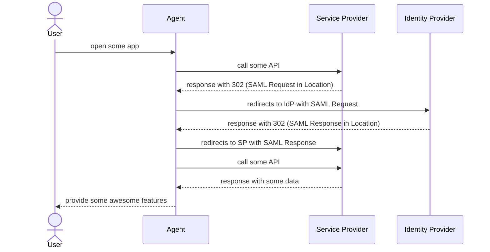

Here is full authentication articles list:

- [Enterprise Authentication. Part 1. Basics](/posts/authn)
- [Enterprise Authentication. Part 2. Directory Services and LDAP](/posts/authn-ldap)
- [Enterprise Authentication. Part 3. Kerberos](/posts/authn-krb)
- Enterprise Authentication. Part 4. SAML <- you are here
- Enterprise Authentication. Part 5. OIDC
- Enterprise Authentication. Part 6. Keycloak in depth

## Why SAML?
In the previous part, we discussed the Kerberos protocol, which excellently solves the problem of secure authentication. So why should we consider anything else? The issue is that Kerberos is very complex. It requires a ton of setup: configuring the server, group policies, domain setup, and adding workstations to the domain. It also imposes several infrastructure requirements (a unified NTP with synchronized clocks across all machines, canonical and trusted DNS, etc.). Typically, for web application authentication on the internet, this is all too complicated. You wouldn’t want to join a Google domain just to log into your Google account. And this is where SAML (Security Assertion Markup Language) comes into play.

> Actually, Kerberos is also trying to keep up. Engineers at MIT and other affiliated organizations recognize the problem, so recent RFCs related to Kerberos attempt to mitigate the protocol’s shortcomings, for example, by introducing more WAN-friendly pre-authentication methods (SPIKE and FAST).

## What is SAML?
SAML (Security Assertion Markup Language) is a much simpler protocol based on the exchange of special XML documents called **Assertions**. An Assertion is a kind of manifest describing a user and their permissions, somewhat similar to a Kerberos ticket, but an Assertion usually contains a bit more information about the user. Just like in Kerberos, a SAML Assertion can be requested for authentication to a specific service (called a **Service Provider** in SAML terms) by a user client (called an **Agent** in SAML) from an authentication service (or, in SAML terms, an **Identity Provider** or simply **IdP**). Such a request for an Assertion is called a **SAML Request**, and in response, the IdP will return a **SAML Response**, which contains the desired Assertion inside, like an envelope.

> It’s very important not to confuse the concepts of a user and an agent. A user is a person who wants to authenticate, while an agent is the application they use to do so. An agent can be your React SPA, mobile app, or even a thick client.

Thus, we end up with something like this:

Actually, SAML positions itself as a transport-independent protocol and can be implemented over HTTP, SOAP, etc. Above, I’ve drawn a diagram of the SAML protocol over HTTP using 302 redirects, but there are several other usage patterns, for example, a common one uses POST requests instead of redirects. In the SAML universe, such usage patterns are called **Bindings**.

There are also several options for who initiates the authentication process. In our diagram, the process is initiated by the SP (i.e., the user comes to the service, which then redirects them to authenticate), but it could also be the IdP (in this case, the user goes to the authentication service first, authenticates, and then chooses which service to use). In SAML, such options are called **Profiles**.

Here, we’ll only cover the WebBrowser SP-initiated SSO profile as the most common one, but keep in mind that others exist.

> For more details on SAML bindings and profiles, you can read [here](https://docs.oasis-open.org/security/saml/v2.0/saml-profiles-2.0-os.pdf).

The best part is that the protocol doesn’t require any additional configuration beyond establishing so-called trust relationships between the SP and IdP. In practice, this is just an exchange of configuration XMLs between the service and the authentication provider. If both are on the internet, it’s enough to specify the respective metadata URLs (containing public cryptographic keys for signature verification) in both places.

## What About Keycloak?
Keycloak can act as both an SP (i.e., connect to an external authentication provider) and an IdP (serve as the authentication provider). Let’s explore both options.

> For further exercises, you can use [my set of docker-compose sandboxes](https://github.com/ondator/sandboxes) and work with the `keycloak/keycloak-postgres-dc.yml` compose file. For this experiment, we’ll configure SAML authentication between two Keycloak instances: one running at `http://keycloak:8080` as the SP and another at `http://keycloak2:8082` as the IdP.

### Keycloak as an IdP
If we want our Keycloak to act as an IdP, all we need to do is create a corresponding client for our SP. Go to the Clients tab and click the Create Client button. You’ll see a form where you should select:

- **Client type**: SAML  
- **Client ID**: Here, surprisingly, you need to enter the URL from which the user will be redirected or the authentication request will be sent. If metadata is available, this should appear in an attribute called `entityID`. In our case, it’s `http://keycloak:8080/realms/master`.  
- **Name** and **Description**: Can be arbitrary.  
- **Root URL** and **Home URL**: If the SP sends relative URLs or doesn’t send them at all, these fields will be used as the corresponding host and URL. Usually, this doesn’t happen, so the fields can be left empty.  
- **Valid redirect URIs**: Effectively an ACL for the addresses to which the user can be redirected with an Assertion. You can enter `*`, but it’s better to specify more precise URLs.  
- **Valid post logout redirect URIs**: Same as above, but for logout.  
- **IDP-Initiated SSO URL name** and **IDP Initiated SSO Relay State**: Settings for IDP-initiated SSO, i.e., the profile where you first go to the IdP and then to the target service. A rare case, so can be left empty.  
- **Master SAML Processing URL**: Here, you can specify the Assertion Consumer URL if it differs from the redirect URI. Usually, this can be left empty.  
- **Name ID format**: In a SAML Assertion, the user is identified by a special field called `NameID`. This setting defines the format of that field. Typically, it’s either `Persistent` (a permanent numeric user ID), `Transient` (a temporary ID generated by the IdP), or `Unspecified` (anything). In case of doubt, use `Unspecified`.  
- **Force name ID format**: The SP can request a specific `NameID` format in its SAML Request. This setting forces Keycloak to ignore that parameter and always send the `NameID` in the format specified above.  
- **Force POST binding**: Determines the binding method for SAML. If enabled, HTTP-POST will be used; if disabled, Redirect. For clarity and ease of debugging, Redirect is better, but security teams might insist on HTTP-POST.  
- **Force artifact binding**: Forces SAML to use the Artifact binding scheme. For clarity, we’ll disable this and the previous setting to use Redirect binding.  
- **Include AuthnStatement**: Adds a corresponding section with Assertion lifetime restrictions. Highly recommended in production.  
- **Include OneTimeUse Condition**: A useful setting that makes the Assertion one-time-use. Prevents MITM attacks, recommended for production.  
- **Sign documents** and **Sign assertions**: Enables digital signing of SAML documents.  

After setting all these, save and check the metadata of the new client at `http://keycloak2:8082/realms/master/protocol/saml/descriptor`.

### Keycloak as an SP
Here, it’s simple. Just feed Keycloak the metadata file. To do this, go to the "Identity Providers" tab and create a new provider, selecting SAML 2.0 from the list.  

In the form that appears, you can arbitrarily fill in the **Alias**, **Display name**, and **Display order** fields, but pay attention to the **SAML settings** section:  

- **Service provider entity ID**: This is both the URL from which the authentication request will be sent and the SP’s ID. In SAML, all IDs are URLs, and every self-respecting SP and IdP will check these URL-IDs for correctness. Ensure the protocol (http/https) is correct, and if your Keycloak admin panel is closed off (e.g., you’re forwarding ports to access it), the host should match the one from which the end user will authenticate. In our case, it’s `http://keycloak:8080/realms/master`.  
- **Use entity descriptor** and **SAML entity descriptor**: These fields define the metadata source for trust relationship setup. Ideally, you’ll either get a ready-made URL (paste it into **SAML entity descriptor**) or an XML file (disable **Use entity descriptor** and paste the file into **Import config from file**). As a result, all metadata fields will be auto-filled. If you’re experimenting with our sandboxes, the metadata will be at `http://keycloak2:8082/realms/master/protocol/saml/descriptor`. If you’re unlucky and don’t have metadata or it’s incorrect, I’ll describe all the necessary fields below.  
- **Identity provider entity ID**: Another URL-ID, but this time for the IdP. It will be listed as the IdP’s identifier, but authentication requests will go to the URL in the next setting. In our experiment, it’s `http://keycloak2:8082/realms/master`.  
- **Single Sign-On service URL**: This is where authentication requests (or user redirects) will go. For us, it’s `http://keycloak2:8082/realms/master/protocol/saml`.  
- **Artifact Resolution service URL** and **ARTIFACT binding response**: Earlier, I said that SAML Response contains the Assertion, but that’s not always true. Sometimes, the IdP asks for another round trip to fetch the Assertion separately using `ArtifactResolve` and `ArtifactResponse` messages. In this case, the `ArtifactResolve` request goes to this URL. In our case, we’ll leave **Artifact Resolution service URL** empty and disable **ARTIFACT binding response**.  
- **Single logout service URL**: SAML supports not only Single Sign-On (SSO) but also Single Logout. For logout (if supported), a separate endpoint is used, specified here. Leave empty in our case.  
- **Backchannel logout**: Another Single Logout setting. Logout in SAML can be done in two ways: via user redirect to the IdP (front-channel logout) or via a server-server request (back-channel). This setting toggles between these modes.  
- **Send 'id_token_hint' in logout requests** and **Send 'client_id' in logout requests**: Specific to some IdPs. Part of the OIDC standard but not SAML. Helps identify the user trying to log out. We’ll disable this since we won’t use logout.  
- **NameID policy format**: In a SAML Assertion, the user is identified by the `NameID` field (though this can be overridden). This setting defines the format of that field. Typically, it’s `Persistent` (a permanent numeric ID), `Transient` (a temporary ID generated by the IdP), or `Unspecified` (anything). In doubt, use `Unspecified`.  

> For more details on SAML fields and types, read the [specification](https://docs.oasis-open.org/security/saml/v2.0/saml-core-2.0-os.pdf).  

- **Principal type** and **Principal attribute**: Overrides the default `NameID`-based user identification. If you prefer another field, choose `Attribute[Name]` or `Attribute[Friendly Name]` and use a different user attribute. For `Name`, you’ll need to write the full attribute name (e.g., `http://schemas.xmlsoap.org/claims/CommonName`), while for `Friendly Name`, a shortened name (`CommonName`) suffices. Generally, it’s best not to tamper with this, as only `NameID` guarantees user uniqueness.  
- **Allow create**: Allows Keycloak to create users on the fly based on Assertion info. We’ll enable this.  
- **HTTP-POST binding response**, **HTTP-POST binding for AuthnRequest**, and **HTTP-POST binding logout**: Determines the SAML binding method. If enabled, HTTP-POST is used; if disabled, Redirect. For clarity and debugging, Redirect is better, but security teams may insist on HTTP-POST.  
- **Want AuthnRequests signed**, **Want Assertions signed**, and **Validate Signatures**: Whether SAML documents are signed. If enabled, you must also specify the key type in **Signature algorithm**, the field containing the signature in **SAML signature key name**, and the key in **Validating X509 certificates**. Security teams usually require this, but we’ll disable it for our experiments.  
- **Want Assertions encrypted**: Requests the IdP to encrypt Assertions. In older Keycloak versions, the encryption key was specified in a neighboring field; now, it’s taken from **Realm Settings > Keys**.  
- **Force authentication**: If enabled, the IdP will require the client to log in even if they already have a working session—effectively disabling SSO.  
- **Sign service provider metadata**: Adds a signature to the metadata XML.  
- **Pass subject**: If enabled, Keycloak passes authenticating user info in the `Subject` field, effectively pre-filling the username in the login form. Not supported by all IdPs—some may even complain—so better to disable.  
- **Allowed clock skew**: A valuable setting if you don’t have NTP. SAML Assertions are only valid for a specific time specified in their `Conditions` node, e.g., `<Conditions NotBefore="2013-03-18T07:38:15.128Z" NotOnOrAfter="2013-03-18T08:48:15.128Z">`. If your NTP is broken, your SP’s time might drift. This setting allows a few seconds of leeway.  

After setting these attributes, save and attempt authentication. If successful, you’ll see a link under the login/password form with your Identity Provider’s name. Clicking it will redirect you to the IdP. After authenticating there, you’ll be returned and granted access to Keycloak.

## A Few Words About ADFS
ADFS (Active Directory Federation Services) is a Windows Server component that serves as the standard service for providing SAML IdP and OIDC functionality on top of Active Directory. It’s commonly found in environments using Active Directory, so here’s a quick guide on setting up ADFS as a SAML IdP:

1. Open the AD FS management console, right-click **Relying Party Trust**, and select **Add Relying Party Trust**.  
2. In the first window, select **Claims Aware**.  
3. In the second window, if the SP’s metadata is publicly available, choose to load the file or specify the URL. If not, select **Enter data about the relying party manually**.  
4. Disable **WS-Federation**, enable **SAML 2.0**, and enter the SP’s URL (ID) from which authentication requests will come.  
5. Enter the URL that will serve as ADFS’s identifier. Ideally, use the ADFS host.  
6. Specify access settings. Consult a security expert here—default is **Permit everyone**.  
7. The main setup is done. Now, add the necessary user data to the Assertion. Right-click the newly created **Relying Party Trust** and select **Edit Claim Issuance Policy**.  
8. If your users are in AD (likely), select **Send LDAP Attributes as Claims**.  
9. Name the **Claim Rule**, select **ActiveDirectory** as the **Attribute Store**, and configure transformations. On the left, select the AD attribute to include in the Assertion; on the right, select (or write) the Assertion attribute where the value will go.  

> You can create multiple transformation rules or pack everything into one—it’s a matter of preference.  

10. If you need to pass AD groups, create a separate rule with the type **Send Group Membership as Claims**.  

## A Few Words About Security
SAML is a very simple protocol, and its security is also straightforward. As you may have noticed during setup, both SAML requests and responses can be signed, and Assertions can even be encrypted using keys exchanged when establishing trust between the SP and IdP. Security is also ensured by the SP’s "exactly once" policy regarding Assertions, though this isn’t configurable in Keycloak. Thus, in production, it’s highly advisable to:  

- Enable signing for Assertions and AuthnRequests.  
- Remove **Allowed clock skew** on the SP side and set Assertion lifetime to a few seconds.  
- Use at least TLS, or better yet, encrypt Assertions.  

## Debugging  
- SAML debugging is simple if you can sniff HTTP traffic on the User Agent. For example, in a browser, open DevTools and search for SAML Requests/Responses. Then, apply base64 decode and review the SAML XML messages.  
- You can also see Keycloak’s SAML processing logs by setting certain env vars:  
  `KEYCLOAK_LOG_LEVEL: WARN,...,org.keycloak.saml.SAMLRequestParser:debug`.  